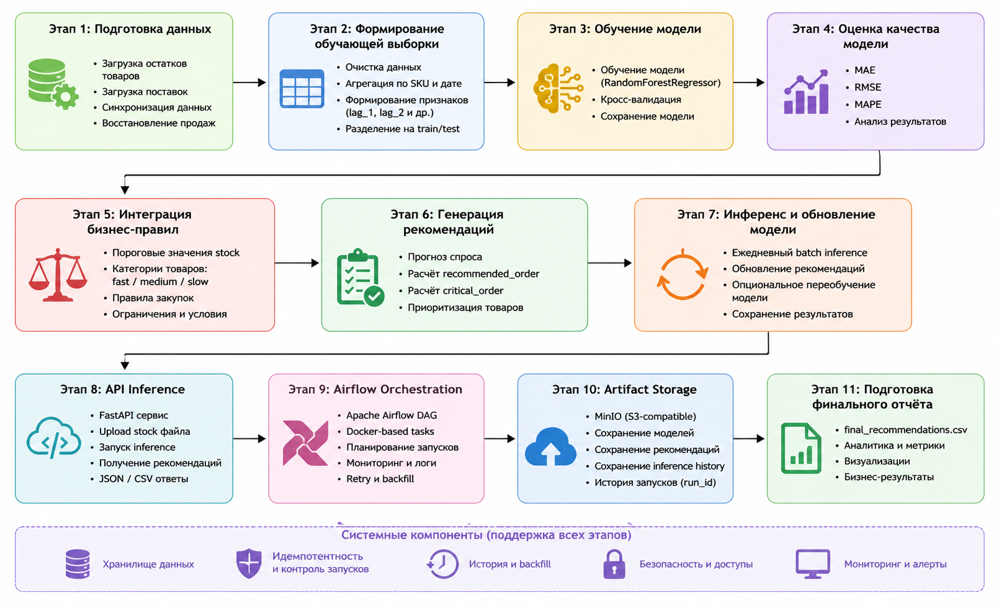

# ML System Design Doc

## 1. Problem Definition

### 1.1 Business Problem

Компания сталкивается с проблемой неэффективного управления складскими запасами.

Основные проблемы:
- частые ситуации out-of-stock (дефицит товаров)
- избыточные запасы (переполнение склада)
- ручное планирование закупок

Это приводит к:
- потере выручки
- увеличению затрат на хранение
- неэффективному использованию капитала

---

### 1.2 Objective

Цель — разработать ML-систему для автоматизации закупок товаров на складе.

Система должна:
- прогнозировать спрос;
- учитывать остатки и поставки;
- формировать рекомендации по закупкам;
- поддерживать batch pipeline;
- поддерживать dynamic inference;
- обеспечивать orchestration через Airflow;
- сохранять артефакты и историю inference в MinIO.

---

### 1.3 Success Metrics

ML metrics:
- MAE
- RMSE
- MAPE

Business metrics:
- снижение out-of-stock;
- снижение overstock;
- уменьшение ручных операций.

System metrics:
- успешное выполнение DAG;
- воспроизводимость inference;
- сохранение history;
- идемпотентность pipeline.

---

### 1.4 Assumptions

- исторические данные отражают будущий спрос
- данные по продажам корректны
- нет сильных внешних факторов (акции, сезонность)

---

### 1.5 Constraints

- ограниченный объём исторических данных;
- локальное развёртывание;
- отсутствие distributed training;
- отсутствие model registry;
- отсутствие automated monitoring.

## 2. Методология Data Scientist

### 2.1 Постановка задачи
- задача: прогнозирование спроса на товары на складе и формирование рекомендаций по закупкам.
- Тип задачи: регрессия (прогноз количества продаж товара).
- Метод: использование моделей машинного обучения для прогнозирования продаж на основе исторических данных (остатки, поставки).

---

### 2.2 Блок-схема решения

- Этап 1: Подготовка данных
- Этап 2: Формирование обучающей выборки
- Этап 3: Обучение модели
- Этап 4: Оценка качества модели
- Этап 5: Интеграция бизнес-правил
- Этап 6: Генерация рекомендаций
- Этап 7: Инференс и обновление модели
- Этап 8: API Inference
- Этап 9: Airflow Orchestration
- Этап 10: Artifact Storage
- Этап 11: Подготовка финального отчёта

---

## 2.3 Этапы решения задачи

---

### Этап 1: Подготовка данных

| Название данных   | Есть ли данные | Источник      | Ресурс | Проверено |
|-------------------|----------------|---------------|--------|-----------|
| Остатки товаров   | Да             | warehouse DB  | DE/DS  | +         |
| Поставки          | Да             | warehouse DB  | DE/DS  | +         |

#### Что делаем:
- очистка данных  
- синхронизация остатков и поставок  
- восстановление продаж (через разницу остатков)  

#### Результат этапа:
- финальный датасет с историей продаж  

---

### Этап 2: Формирование выборки

#### MVP:
- данные делятся на train/test  
- формируются признаки:
  - текущий stock  
  - предыдущие продажи  
  - поставки  

- целевая переменная:  
  `y = количество продаж товара в день`

- горизонт прогноза:  
  `1 день вперёд`

- метрики качества:
  - MAE (Mean Absolute Error)

- риски:
  - мало данных (10 дней)  
  - нестабильность прогноза  

#### Baseline:
- простая модель:
  - средние продажи  

- метрика:
  - MAE  

- цель:
  - базовый ориентир  

---

### Этап 3: Обучение модели

#### MVP:
- используется ML модель (регрессия)
- разделение:
  - train / test  

- техника:
  - sklearn модели  

- метрики:
  - MAE  
  - RMSE (дополнительно)  

- риски:
  - переобучение  
  - нестабильность при малом количестве данных  

#### Baseline:
- простая эвристика:
  - среднее значение продаж  

---

### Этап 4: Оценка качества модели

#### MVP:

- основная метрика:
  - MAE  

#### Почему MAE:
- интерпретируемая (ошибка в штуках товара)  
- напрямую влияет на закупки  

#### Дополнительно:
- RMSE (чувствительность к выбросам)  
- MAPE (процентная ошибка)  

#### Связь с бизнесом:
- ошибка → лишние закупки или дефицит  

#### Baseline:
- MAE используется для сравнения с MVP  

---

### Этап 5: Интеграция бизнес-правил

#### MVP:

- формирование рекомендаций:
 - если stock < threshold → закупка
 - если спрос высокий → увеличить закупку
 - если товар не продаётся → не закупать

- используются категории:
  - fast / medium / slow товары  

- риски:
  - ошибки прогноза → неправильные закупки  

#### Baseline:
- простые правила:
  - фиксированный уровень закупки  

---

### Этап 6: Генерация рекомендаций

#### MVP:

- результат:
 - final_recommendations.csv
 
- содержит:
  - товар  
  - текущий stock  
  - прогноз  
  - рекомендация  

---

### Этап 7: Инференс и orchestration

#### MVP:

Система поддерживает:

- batch inference через Airflow;
- dynamic inference через FastAPI;
- DAG orchestration;
- Docker-based execution;
- artifact upload в MinIO;
- inference history;
- backfill.

Inference может запускаться:
- по расписанию;
- вручную;
- через API upload.

---

### Этап 8: API Layer

#### MVP:

FastAPI используется как inference service layer.

Поддерживаются:
- upload stock files;
- inference execution;
- recommendation retrieval;
- JSON responses;
- Swagger UI.

Основные endpoints:
- `/upload-stock-and-inference`
- `/recommendations/latest`
- `/recommendations/latest-json`

---

### Этап 9: Artifact Storage

#### MVP:

Артефакты сохраняются в MinIO (S3-compatible storage).

Сохраняются:
- модели;
- inference recommendations;
- inference history;
- historical DAG runs.

Используется versioned storage:
- execution_date
- run_id

Это обеспечивает:
- reproducibility;
- backfill;
- idempotency;
- historical tracking.

---

### Этап 10: Airflow Orchestration

#### MVP:

Apache Airflow используется как orchestration layer.

Pipeline разделён на Docker-based tasks:

- check_idempotency
- load_data
- preprocess_data
- run_ml_pipeline
- run_inference
- upload_to_minio
- backfill_task

Airflow обеспечивает:
- scheduling;
- retry;
- monitoring;
- logs;
- historical DAG runs;
- backfill support.

---

### Этап 11: Финальный результат

#### MVP:

- готовая система рекомендаций  
- автоматическое обновление  

#### Бизнес-результат:
- снижение излишков  
- уменьшение дефицита  
- оптимизация склада  

#### Baseline:
- базовый анализ продаж  

## 3. Future Improvements

- asynchronous inference;
- streaming ingestion;
- automatic retraining;
- CI/CD pipeline;
- Kubernetes deployment;
- distributed execution;
- feature store;
- monitoring dashboard;
- model versioning.