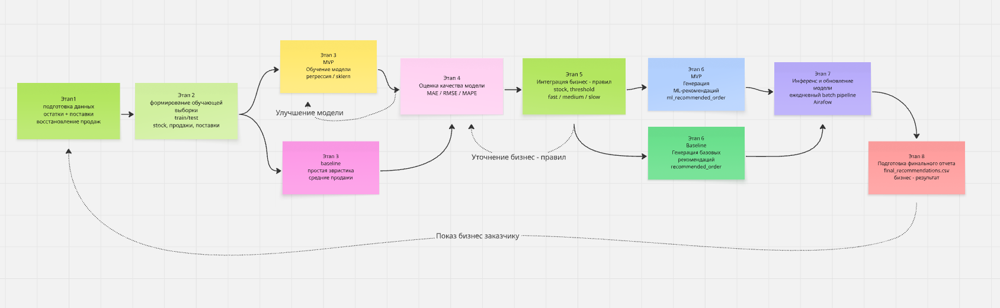

# ML System Design Doc

## 1. Problem Definition

### 1.1 Business Problem

Компания сталкивается с проблемой неэффективного управления складскими запасами.

Основные проблемы:
- частые ситуации out-of-stock (дефицит товаров)
- избыточные запасы (переполнение склада)
- ручное планирование закупок

Это приводит к:
- потере выручки
- увеличению затрат на хранение
- неэффективному использованию капитала

---

### 1.2 Objective

Цель — разработать ML-систему, которая автоматизирует процесс принятия решений по закупкам.

Система должна:
- прогнозировать спрос на товары
- учитывать текущие остатки
- формировать рекомендации по закупкам

---

### 1.3 Success Metrics

Метрики эффективности:

- MAE (ошибка прогноза)
- снижение out-of-stock
- снижение избыточных запасов

---

### 1.4 Assumptions

- исторические данные отражают будущий спрос
- данные по продажам корректны
- нет сильных внешних факторов (акции, сезонность)

---

### 1.5 Constraints

- ограниченное количество данных
- отсутствие внешних факторов
- возможный шум в данных

## 2. Методология Data Scientist

### 2.1 Постановка задачи
- задача: прогнозирование спроса на товары на складе и формирование рекомендаций по закупкам.
- Тип задачи: регрессия (прогноз количества продаж товара).
- Метод: использование моделей машинного обучения для прогнозирования продаж на основе исторических данных (остатки, поставки).

---

### 2.2 Блок-схема решения

- Этап 1: Подготовка данных
- Этап 2: Формирование обучающей выборки
- Этап 3: Обучение модели
- Этап 4: Оценка качества модели
- Этап 5: Интеграция бизнес-правил
- Этап 6: Генерация рекомендаций
- Этап 7: Инференс и обновление модели
- Этап 8: Подготовка финального отчёта

---

## 2.3 Этапы решения задачи

---

### Этап 1: Подготовка данных

| Название данных   | Есть ли данные | Источник      | Ресурс | Проверено |
|-------------------|----------------|---------------|--------|-----------|
| Остатки товаров   | Да             | warehouse DB  | DE/DS  | +         |
| Поставки          | Да             | warehouse DB  | DE/DS  | +         |

#### Что делаем:
- очистка данных  
- синхронизация остатков и поставок  
- восстановление продаж (через разницу остатков)  

#### Результат этапа:
- финальный датасет с историей продаж  

---

### Этап 2: Формирование выборки

#### MVP:
- данные делятся на train/test  
- формируются признаки:
  - текущий stock  
  - предыдущие продажи  
  - поставки  

- целевая переменная:  
  `y = количество продаж товара в день`

- горизонт прогноза:  
  `1 день вперёд`

- метрики качества:
  - MAE (Mean Absolute Error)

- риски:
  - мало данных (10 дней)  
  - нестабильность прогноза  

#### Baseline:
- простая модель:
  - средние продажи  

- метрика:
  - MAE  

- цель:
  - базовый ориентир  

---

### Этап 3: Обучение модели

#### MVP:
- используется ML модель (регрессия)
- разделение:
  - train / test  

- техника:
  - sklearn модели  

- метрики:
  - MAE  
  - RMSE (дополнительно)  

- риски:
  - переобучение  
  - нестабильность при малом количестве данных  

#### Baseline:
- простая эвристика:
  - среднее значение продаж  

---

### Этап 4: Оценка качества модели

#### MVP:

- основная метрика:
  - MAE  

#### Почему MAE:
- интерпретируемая (ошибка в штуках товара)  
- напрямую влияет на закупки  

#### Дополнительно:
- RMSE (чувствительность к выбросам)  
- MAPE (процентная ошибка)  

#### Связь с бизнесом:
- ошибка → лишние закупки или дефицит  

#### Baseline:
- MAE используется для сравнения с MVP  

---

### Этап 5: Интеграция бизнес-правил

#### MVP:

- формирование рекомендаций:
 - если stock < threshold → закупка
 - если спрос высокий → увеличить закупку
 - если товар не продаётся → не закупать

- используются категории:
  - fast / medium / slow товары  

- риски:
  - ошибки прогноза → неправильные закупки  

#### Baseline:
- простые правила:
  - фиксированный уровень закупки  

---

### Этап 6: Генерация рекомендаций

#### MVP:

- результат:
 - final_recommendations.csv
 
- содержит:
  - товар  
  - текущий stock  
  - прогноз  
  - рекомендация  

---

### Этап 7: Инференс и обновление модели

#### MVP:

- частота:
  - ежедневно  

- реализация:
  - batch pipeline через Airflow  

#### Baseline:
- ручной пересчёт  

---

### Этап 8: Финальный результат

#### MVP:

- готовая система рекомендаций  
- автоматическое обновление  

#### Бизнес-результат:
- снижение излишков  
- уменьшение дефицита  
- оптимизация склада  

#### Baseline:
- базовый анализ продаж  